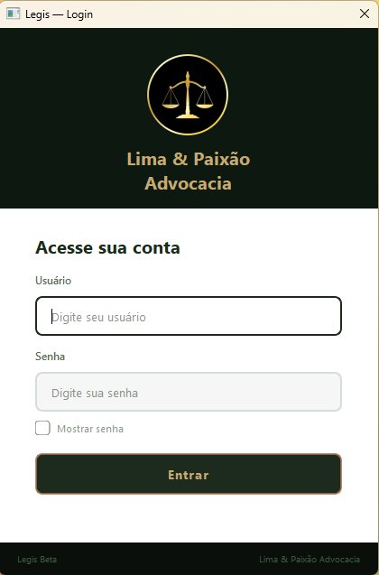
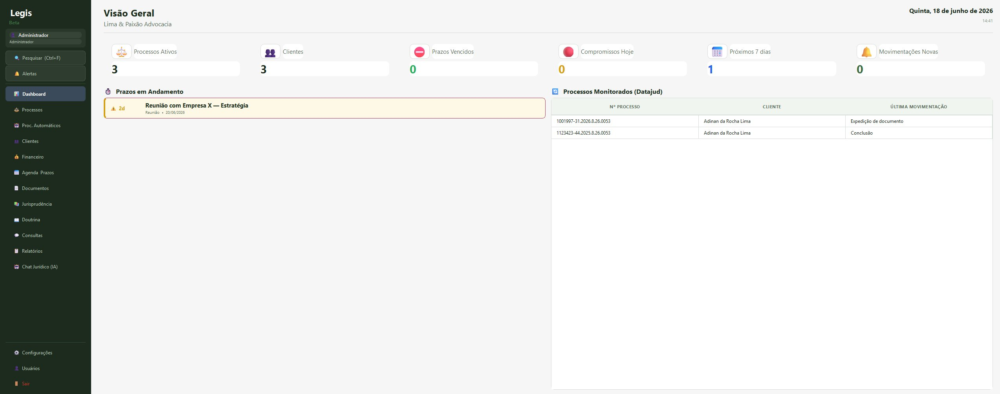
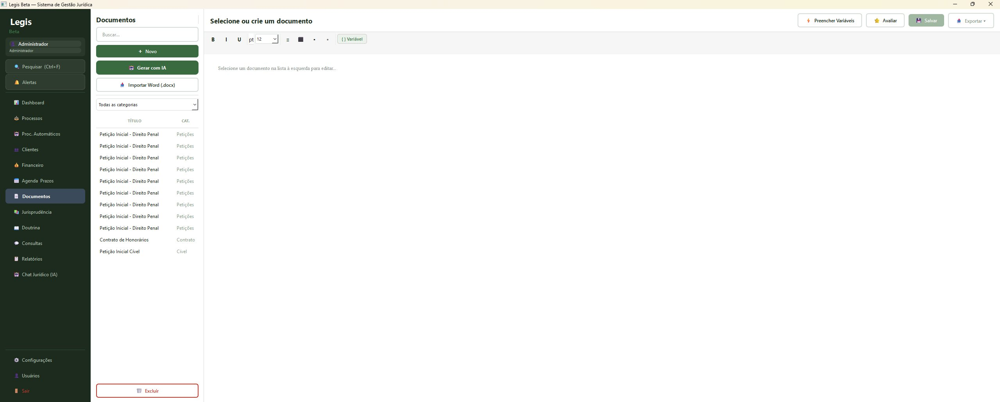
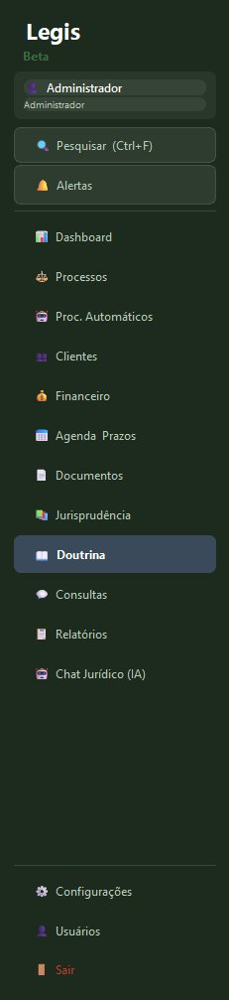

# ⚖️ Legis — Sistema de Gestão Jurídica com Inteligência Artificial

> Plataforma desktop completa para escritórios de advocacia, com geração de peças por IA, monitoramento processual automático e busca inteligente em jurisprudência.

---

## 📌 Sobre o projeto

O **Legis** é um sistema desktop que desenvolvi para resolver uma dor real da advocacia: a fragmentação entre gestão de processos, pesquisa jurídica e produção de peças. Reúne, num só lugar, gestão de escritório, um módulo completo de Inteligência Artificial e o monitoramento automático de processos junto ao CNJ.

> 🔒 *Este repositório é uma **vitrine técnica**. O código-fonte completo é mantido em repositório privado por se tratar de um produto em desenvolvimento. Acesso pode ser concedido a recrutadores mediante solicitação.*

---

## ✨ Principais funcionalidades

### 🤖 Módulo de Inteligência Artificial
- **Chat jurídico** com múltiplos provedores de IA (Google Gemini, Groq, Anthropic Claude) e **fallback automático** entre eles
- **Geração automatizada de peças** processuais seguindo um template-mestre forense, com dados do advogado preenchidos automaticamente
- **RAG (Retrieval-Augmented Generation)** — busca semântica no acervo de jurisprudência e doutrina do próprio escritório, usando embeddings
- **Sistema multi-agente** — agentes especializados (estratégico, jurisprudência, doutrina, redator, revisor) que colaboram na elaboração de peças complexas
- **Aprendizado por avaliação** — o sistema aprende com o feedback do advogado sobre as peças geradas

### 📡 Central de Monitoramento Processual
- Integração com a **API pública do Datajud (CNJ)**
- **Varredura automática** dos processos cadastrados a cada abertura do sistema
- Detecção e alerta de **novas movimentações** processuais
- Painel de acompanhamento no dashboard

### 📁 Gestão de Escritório
- Cadastro de processos, clientes, prazos e compromissos
- Controle financeiro (honorários, receitas, despesas) com gráficos
- Geração e exportação de documentos (DOCX / PDF)
- Dashboard com visão geral e alertas de prazos

---

## 🛠️ Tecnologias e arquitetura

| Camada | Tecnologias |
|--------|-------------|
| **Linguagem** | Python 3.11 |
| **Interface** | PyQt6 |
| **Banco de dados** | SQLite |
| **IA / LLMs** | Google Gemini, Groq (Llama 3.3), Anthropic Claude |
| **RAG / Embeddings** | ChromaDB, sentence-transformers |
| **Integrações** | API Datajud (CNJ), APIs REST |

### Destaques de arquitetura
- **Isolamento de processos:** operações de rede e bibliotecas pesadas (IA, RAG, exportação, consultas) rodam em *subprocessos* separados, evitando conflitos com o event loop do Qt e garantindo estabilidade.
- **Cascata de provedores de IA:** abstração que permite trocar de provedor e cair automaticamente para alternativas quando um serviço falha ou atinge limite de uso.
- **Threading seguro:** uso disciplinado de QThread com proteção contra condições de corrida na interface.

---

## 🖥️ Interface do Sistema

<table>
  <tr>
    <td align="center" width="50%">
      <b>Tela de Login</b>  
      
    </td>
    <td align="center" width="50%">
      <b>Dashboard — Visão Geral</b>  
      
    </td>
  </tr>
  <tr>
    <td align="center" width="50%">
      <b>Gestão de Documentos com IA</b>  
      
    </td>
    <td align="center" width="50%">
      <b>Módulos do Sistema</b>  
      
    </td>
  </tr>
</table>

---

## 👤 Autor

**Adinan da Rocha Lima**
Advogado (OAB/SP) e desenvolvedor — perfil híbrido jurídico + tecnologia.
Estudante de Engenharia de Computação.

- 💼 LinkedIn: [adinan-lima](https://www.linkedin.com/in/adinan-lima-7a17402b9)
- 🐙 GitHub: [@Adinan001](https://github.com/Adinan001)
- 📧 adinansp@gmail.com

---

## 📝 Observações

Projeto desenvolvido de forma independente, do levantamento de requisitos à arquitetura, implementação e testes. Nasceu da prática jurídica real e segue em evolução contínua.
